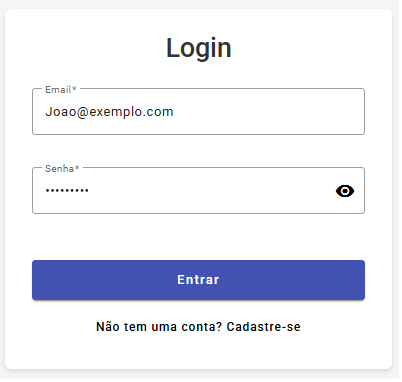
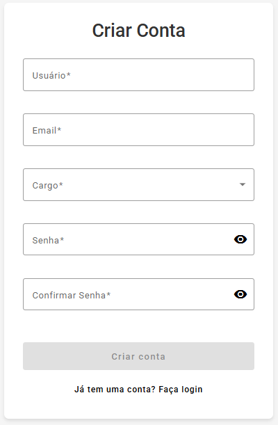
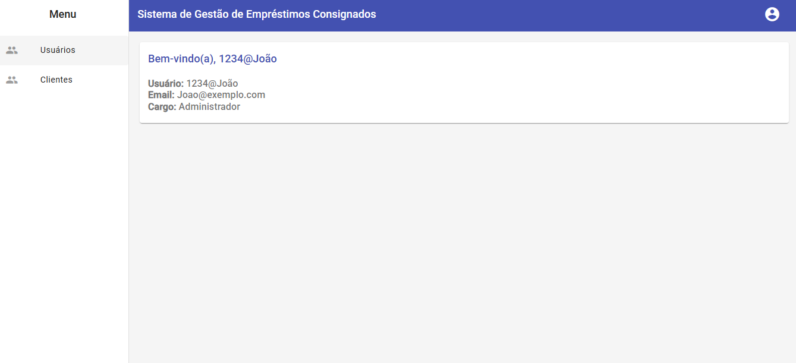
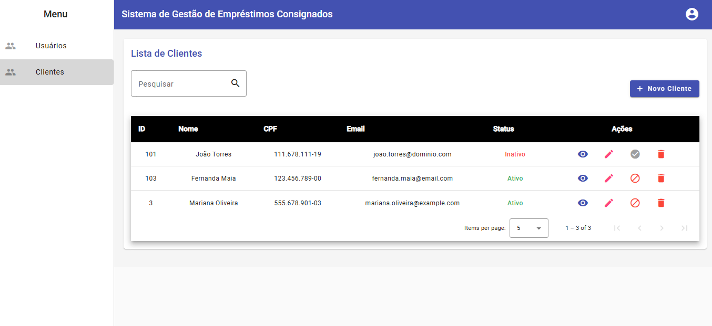
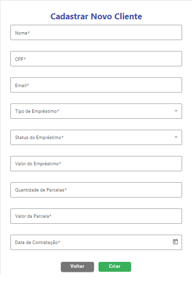
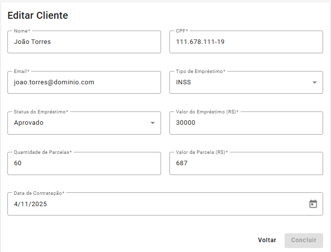
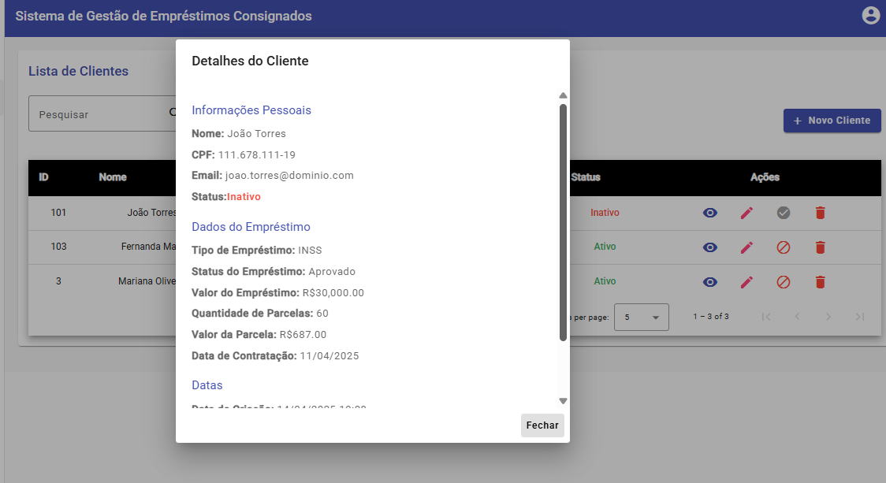

# Sistema de Gestão de Empréstimos Consignados

[ Português](#português) | [ English](#english)

---

# <a name="português"></a> Português

## Sumário
- [Visão Geral](#visão-geral)
- [Rodando com Docker](#rodando-com-docker)
- [Instalação (Sem Docker)](#instalação)
- [Funcionalidades](#funcionalidades)
- [Tecnologias](#tecnologias)
- [Configuração do Banco de Dados Oracle Local](#configuracao-do-banco-de-dados-oracle-local)
- [Frontend](#frontend)
- [Backend](#backend)
- [Exemplos de Uso](#exemplos-de-uso)
- [Prints da Aplicação](#prints-da-aplicação)
- [Estrutura de Diretórios](#estrutura-de-diretórios)
- [Testes](#testes)
- [Observações](#observações)

---

## Como executar o projeto

Existem dois caminhos para executar a aplicação:

1. **Com Docker** (recomendado): Sobe todos os serviços automaticamente em containers.
2. **Sem Docker** (tradicional/manual): Instala e configura cada parte separadamente.

Escolha o método que preferir e siga as instruções correspondentes abaixo.

## Visão Geral

O Sistema de Gestão de Empréstimos Consignados é uma solução completa para administração de clientes, contratos de empréstimo e controle financeiro de operações consignadas. Desenvolvido em .NET 9.0 (ASP.NET Core Web API) e Angular, o sistema oferece uma interface moderna e segura, com autenticação JWT e integração total com banco Oracle.

### Funcionalidades Principais

- **Cadastro, consulta, edição e exclusão de clientes**  
  Gerencie todos os dados dos clientes, incluindo informações pessoais e documentos.

- **Gestão de empréstimos consignados**  
  Crie, visualize, edite e exclua contratos de empréstimo associados a clientes, com controle de valores, taxas, datas e condições.

- **Controle de parcelas**  
  Visualize, gere e acompanhe o pagamento das parcelas de cada empréstimo, incluindo status (paga/pendente/atrasada).

- **Autenticação e autorização via JWT**  
  Acesso seguro à API e ao frontend, com controle de permissões para usuários autenticados.

- **Dashboard e relatórios**  
  Visualize informações consolidadas, como total de empréstimos ativos, valores a receber, inadimplência e histórico de operações.

- **Pesquisa e filtros avançados**  
  Localize rapidamente clientes ou empréstimos usando filtros por nome, CPF, situação do contrato, período, etc.

- **Histórico de operações**  
  Consulte logs de alterações e ações realizadas por usuários no sistema.

- **Interface responsiva e intuitiva**  
  Frontend moderno em Angular, adaptado para uso em desktop e dispositivos móveis.

- **API RESTful documentada (Swagger)**  
  Endpoints organizados e facilmente testáveis para integração com outros sistemas ou desenvolvimento de novas funcionalidades.

## Rodando com Docker

Se você já possui Docker e Docker Compose instalados, pode rodar toda a aplicação (banco Oracle, backend e frontend) com um único comando.

### Pré-requisitos
- Docker e Docker Compose instalados na máquina.

### Passos rápidos
```bash
# Na raiz do projeto, execute:
docker-compose up
```

- O Docker irá baixar as imagens necessárias, criar os containers e iniciar todos os serviços.
- **É OBRIGATÓRIO executar a migration para criar as tabelas no banco Oracle.**
- Abra um terminal na pasta do backend:
  ```bash
  cd Backend/WebAPI_EmprestimoConsignado
  dotnet ef database update
  ```
- Pronto! As tabelas serão criadas no banco Oracle do container.
- O backend (.NET) e frontend (Angular) estarão prontos para uso.

### Como acessar
- Frontend: http://localhost:4200
- Backend (Swagger ou API): http://localhost:8080

### Observações
- O método tradicional/manual de execução (sem Docker) continua documentado abaixo.
- Para desenvolvedores que preferem rodar cada parte separadamente, siga as instruções das seções de Backend, Frontend e Banco de Dados.

## Instalação (Sem Docker)
```bash
# Clone o repositório
git clone [url-do-seu-repositório]
cd [nome-do-projeto]
```
### Backend
```bash
cd Backend
dotnet restore
dotnet ef database update
dotnet run
```
### Frontend
```bash
cd Frontend
npm install
ng serve --open
```
Acesse: [http://localhost:4200](http://localhost:4200)

## Funcionalidades
- Autenticação e autorização de usuários (JWT)
- Cadastro e login de usuários
- CRUD completo de clientes
- Endpoints seguros
- Frontend Angular responsivo
- Controle de empréstimos consignados

## Tecnologias
- Backend: .NET 9.0, ASP.NET Core Web API, Entity Framework Core, Oracle Database
- Frontend: Angular 17+, Angular Material, RxJS, TypeScript, HTML5, SCSS

## Configuração do Banco de Dados Oracle Local

### 1. Instalar o Oracle XE (Express Edition)
- Baixe em: https://www.oracle.com/database/technologies/xe-downloads.html
- Siga o instalador padrão e anote a senha do usuário SYSTEM.

### 2. Instalar o Oracle SQL Developer
- Baixe em: https://www.oracle.com/tools/downloads/sqldev-downloads.html
- Instale normalmente.

### 3. Conectar ao banco Oracle XE pelo SQL Developer
- Nova conexão:  
  - Nome da conexão: emprestimo  
  - Usuário: SYSTEM  
  - Senha: (a definida na instalação)  
  - Host: localhost  
  - Porta: 1521  
  - SID: XE  

### 4. Criar usuário/schema para a aplicação
No SQL Developer, execute:
```sql
CREATE USER emprestimo IDENTIFIED BY sua_senha_segura;
GRANT CONNECT, RESOURCE TO emprestimo;
ALTER USER emprestimo QUOTA UNLIMITED ON USERS;
```

### 5. Criar as tabelas do sistema
- Execute os scripts SQL fornecidos na pasta `/scripts` do projeto.

### 6. Configurar a string de conexão no backend
- Defina a variável de ambiente `DefaultConnection_EmprestimoConsignado`:
  ```
  User Id=emprestimo;Password=sua_senha_segura;Data Source=localhost:1521/XE
  ```
- Ou edite o arquivo `appsettings.json`:
  ```json
  "ConnectionStrings": {
    "DefaultConnection_EmprestimoConsignado": "User Id=emprestimo;Password=sua_senha_segura;Data Source=localhost:1521/XE"
  }
  ```

### 7. Exemplo de appsettings.json
```json
{
    "Logging": {
        "LogLevel": {
            "Default": "Information",
            "Microsoft.AspNetCore": "Warning"
        }
    },
    "AppSettings": {
        "Token": "SUA_CHAVE_SECRETA_AQUI"
    },
    "ConnectionStrings": {
        "DefaultConnection_EmprestimoConsignado": "User Id=emprestimo;Password=sua_senha_segura;Data Source=localhost:1521/XE"
    },
    "AllowedHosts": "*"
}
```

### 8. Executando a migration (criação das tabelas)
- **É OBRIGATÓRIO executar a migration para criar as tabelas no banco Oracle.**
- Abra um terminal na pasta do backend:
  ```bash
  cd Backend/WebAPI_EmprestimoConsignado
  dotnet ef database update
  ```
- Pronto! As tabelas serão criadas no banco Oracle configurado.

## Frontend
O frontend utiliza Angular e Angular Material para uma interface moderna e responsiva.

### Principais Funcionalidades
- Listagem, cadastro, edição, inativação e exclusão de clientes
- Autenticação/login
- Controle de permissões (ações administrativas só para admins)
- Paginação, ordenação, busca
- Diálogos de confirmação
- Integração total com backend REST

### Tecnologias
- Angular 17+
- Angular Material
- RxJS
- TypeScript
- HTML5 & SCSS/CSS3

## Backend
Backend robusto em .NET Core Web API, com autenticação JWT, CRUD de clientes, integração Oracle.

## Exemplos de Uso
### Login (POST)
```http
POST /api/Auth/Login
Content-Type: application/json
{
  "email": "admin@empresa.com",
  "senha": "suaSenha"
}
```
### Cadastrar Cliente (POST)
```http
POST /api/Cliente
Authorization: Bearer {jwt_token}
Content-Type: application/json
{
  "nome": "João Silva",
  "cpf": "123.456.789-00",
  "email": "joao@exemplo.com",
  "dataContratacao": "2025-04-15T00:00:00Z"
}
```
### Listar Clientes (GET)
```http
GET /api/Cliente
Authorization: Bearer {jwt_token}
```
### Exemplo de Resposta
```json
[
  {
    "id": 1,
    "nome": "João Silva",
    "cpf": "123.456.789-00",
    "email": "joao@exemplo.com",
    "ativo": true
  }
]
```

## Prints da Aplicação
### 1. Tela de Login
[](Prints/Login.png)
<p align="center"><i>Tela inicial para autenticação do usuário.</i></p>

### 2. Criar Conta
[](Prints/Criar_Conta.png)
<p align="center"><i>Formulário para novos usuários criarem sua conta.</i></p>

### 3. Lista de Usuários
[](Prints/Usuarios.png)
<p align="center"><i>Visualização dos usuários cadastrados.</i></p>

### 4. Lista de Clientes
[](Prints/Clientes.png)
<p align="center"><i>Clientes cadastrados, com busca, paginação e ações.</i></p>

### 5. Cadastrar Novo Cliente
[](Prints/Cadastrar_novo_cliente.png)
<p align="center"><i>Adicionar novo cliente ao sistema.</i></p>

### 6. Editar Cliente
[](Prints/Editar_Cliente.png)
<p align="center"><i>Editar dados de um cliente existente.</i></p>

### 7. Detalhes do Cliente
[](Prints/Detalhes_Cliente.png)
<p align="center"><i>Visualização detalhada de um cliente.</i></p>

## Estrutura de Diretórios
### Frontend
```
Frontend/
  └── src/
      └── app/
          ├── clientes/           # Componentes e serviços de clientes
          ├── auth/               # Autenticação e guarda de rotas
          └── ...                 # Outros módulos e componentes
```
### Backend
```
Backend/
  ├── Controllers/           # Controllers da API
  ├── Models/                # Modelos de dados
  ├── Service/               # Serviços de negócio
  ├── DTO/                   # Data Transfer Objects
  ├── Enums/                 # Enumerações
  └── ...
```

## Testes
- Use o Swagger para testar os endpoints durante o desenvolvimento.
- Para testes automatizados, utilize `dotnet test`.

## Observações
- O sistema segue boas práticas de arquitetura, separando responsabilidades.
- Recomenda-se configurar variáveis de ambiente para dados sensíveis em produção.

---

# <a name="english"></a> English

## Table of Contents
- [Overview](#overview)
- [Running with Docker](#running-with-docker)
- [Installation (Without Docker)](#installation)
- [Features](#features)
- [Technologies](#technologies)
- [Oracle Local Database Setup](#oracle-local-database-setup)
- [Frontend](#frontend-1)
- [Backend](#backend-1)
- [Usage Examples](#usage-examples)
- [Application Screenshots](#application-screenshots)
- [Project Structure](#project-structure)
- [Tests](#tests)
- [Notes](#notes)

---

## How to run the project

There are two ways to run the application:

1. **With Docker** (recommended): Automatically starts all services in containers.
2. **Without Docker** (traditional/manual): Install and configure each part separately.

Choose your preferred method and follow the instructions below.

## Overview
A comprehensive Payroll Loan Management System built with .NET 9.0 (ASP.NET Core Web API) and Angular. Features JWT authentication, Oracle Database integration, full client and loan management, and a modern, responsive frontend.

## Running with Docker

If you already have Docker and Docker Compose installed, you can run the entire application (Oracle database, backend, and frontend) with a single command.

### Prerequisites
- Docker and Docker Compose installed on the machine.

### Quick Steps
```bash
# In the project root, run:
docker-compose up
```

- Docker will download the necessary images, create the containers, and start all services.
- **It is MANDATORY to run the migration to create the tables in the Oracle database.**
- Open a terminal in the backend folder:
  ```bash
  cd Backend/WebAPI_EmprestimoConsignado
  dotnet ef database update
  ```
- Done! The tables will be created in the Oracle database inside the container.
- The backend (.NET) and frontend (Angular) will be ready for use.

### How to Access
- Frontend: http://localhost:4200
- Backend (Swagger or API): http://localhost:8080

### Notes
- The traditional/manual execution method (without Docker) is still documented below.
- For developers who prefer to run each part separately, follow the instructions in the Backend, Frontend, and Database sections.

## Installation (Without Docker)
```bash
# Clone the repository
git clone [your-repo-url]
cd [your-project-name]
```
### Backend
```bash
cd Backend
dotnet restore
dotnet ef database update
dotnet run
```
### Frontend
```bash
cd Frontend
npm install
ng serve --open
```
Access: [http://localhost:4200](http://localhost:4200)

## Features
- User Authentication and Authorization (JWT)
- User Registration and Login
- Full Client CRUD Management
- Secure API Endpoints
- Responsive Angular Frontend
- Consigned Loan Tracking

## Technologies
- Backend: .NET 9.0, ASP.NET Core Web API, Entity Framework Core, Oracle Database
- Frontend: Angular 17+, Angular Material, RxJS, TypeScript, HTML5, SCSS

## Oracle Local Database Setup

### 1. Install Oracle XE (Express Edition)
- Download from: https://www.oracle.com/database/technologies/xe-downloads.html
- Follow the installer and note the SYSTEM user password.

### 2. Install Oracle SQL Developer
- Download from: https://www.oracle.com/tools/downloads/sqldev-downloads.html
- Install normally.

### 3. Connect to Oracle XE using SQL Developer
- New connection:  
  - Connection Name: emprestimo  
  - User: SYSTEM  
  - Password: (the one you set)  
  - Host: localhost  
  - Port: 1521  
  - SID: XE  

### 4. Create application user/schema
In SQL Developer, run:
```sql
CREATE USER emprestimo IDENTIFIED BY your_secure_password;
GRANT CONNECT, RESOURCE TO emprestimo;
ALTER USER emprestimo QUOTA UNLIMITED ON USERS;
```

### 5. Create system tables
- Run the SQL scripts provided in the `/scripts` folder.

### 6. Configure the connection string in the backend
- Set the environment variable `DefaultConnection_EmprestimoConsignado`:
  ```
  User Id=emprestimo;Password=your_secure_password;Data Source=localhost:1521/XE
  ```
- Or edit the `appsettings.json` file:
  ```json
  "ConnectionStrings": {
    "DefaultConnection_EmprestimoConsignado": "User Id=emprestimo;Password=your_secure_password;Data Source=localhost:1521/XE"
  }
  ```

### 7. Example appsettings.json
```json
{
    "Logging": {
        "LogLevel": {
            "Default": "Information",
            "Microsoft.AspNetCore": "Warning"
        }
    },
    "AppSettings": {
        "Token": "YOUR_SECRET_KEY_HERE"
    },
    "ConnectionStrings": {
        "DefaultConnection_EmprestimoConsignado": "User Id=emprestimo;Password=your_secure_password;Data Source=localhost:1521/XE"
    },
    "AllowedHosts": "*"
}
```

### 8. Running the migration (table creation)
- **It is MANDATORY to run the migration to create the tables in the Oracle database.**
- Open a terminal in the backend folder:
  ```bash
  cd Backend/WebAPI_EmprestimoConsignado
  dotnet ef database update
  ```
- Done! The tables will be created in the configured Oracle database.

## Frontend
The frontend is built with Angular and Angular Material for a modern, responsive UI for client and loan management.

### Main Features
- List, create, edit, inactivate, and delete clients
- User authentication and login
- Permission control (admin-only actions)
- Pagination, sorting, searching
- Confirmation dialogs
- Full integration with backend REST

### Technologies
- Angular 17+
- Angular Material
- RxJS
- TypeScript
- HTML5 & SCSS/CSS3

## Backend
Robust backend in .NET Core Web API, with JWT authentication, client CRUD, Oracle integration.

## Usage Examples
### Login (POST)
```http
POST /api/Auth/Login
Content-Type: application/json
{
  "email": "admin@company.com",
  "senha": "yourPassword"
}
```
### Create Client (POST)
```http
POST /api/Cliente
Authorization: Bearer {jwt_token}
Content-Type: application/json
{
  "nome": "John Smith",
  "cpf": "123.456.789-00",
  "email": "john@example.com",
  "dataContratacao": "2025-04-15T00:00:00Z"
}
```
### List Clients (GET)
```http
GET /api/Cliente
Authorization: Bearer {jwt_token}
```
### Example Response
```json
[
  {
    "id": 1,
    "nome": "John Smith",
    "cpf": "123.456.789-00",
    "email": "john@example.com",
    "ativo": true
  }
]
```

## Application Screenshots
### 1. Login Screen
[](Prints/Login.png)
<p align="center"><i>User authentication screen.</i></p>

### 2. Create Account
[](Prints/Criar_Conta.png)
<p align="center"><i>Form for new users to register.</i></p>

### 3. User List
[](Prints/Usuarios.png)
<p align="center"><i>View of registered users.</i></p>

### 4. Client List
[](Prints/Clientes.png)
<p align="center"><i>Registered clients, with search, pagination, actions.</i></p>

### 5. Register New Client
[](Prints/Cadastrar_novo_cliente.png)
<p align="center"><i>Add a new client to the system.</i></p>

### 6. Edit Client
[](Prints/Editar_Cliente.png)
<p align="center"><i>Edit an existing client's data.</i></p>

### 7. Client Details
[](Prints/Detalhes_Cliente.png)
<p align="center"><i>Detailed view of a client.</i></p>

## Project Structure
### Frontend
```
Frontend/
  └── src/
      └── app/
          ├── clientes/           # Client components and services
          ├── auth/               # Authentication and route guards
          └── ...                 # Other modules and components
```
### Backend
```
Backend/
  ├── Controllers/           # API Controllers
  ├── Models/                # Data Models
  ├── Service/               # Business Services
  ├── DTO/                   # Data Transfer Objects
  ├── Enums/                 # Enumerations
  └── ...
```

## Tests
- Use Swagger to test the endpoints during development.
- For automated tests, use `dotnet test`.

## Notes
- The system follows best practices for architecture and separation of concerns.
- It is recommended to configure environment variables for sensitive data in production.
