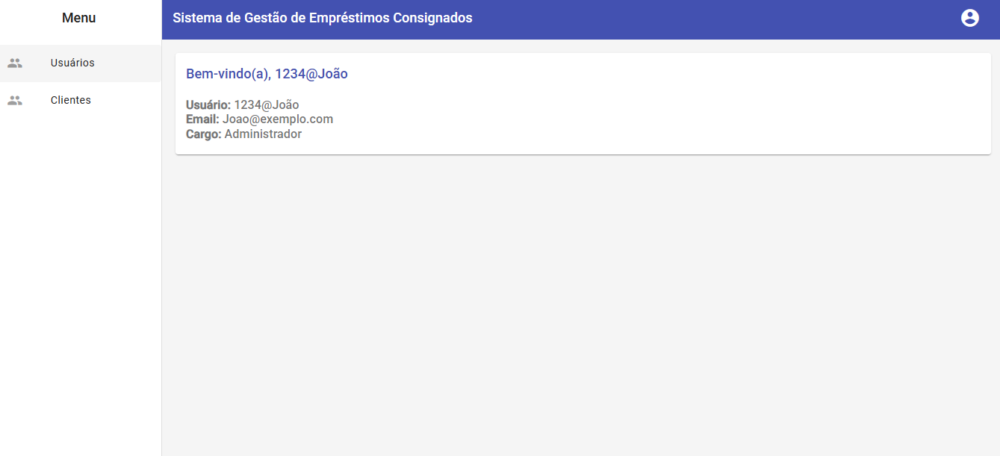

# 🏦 Sistema de Gestão de Empréstimos Consignados

[](https://github.com/seu-usuario/seu-repo/actions)
[](LICENSE)
[](https://angular.io/)
[](https://dotnet.microsoft.com/)

# Payroll Loan Management System

[🇧🇷 Português](#português) | [🇺🇸 English](#english)

---

## 📑 Sumário / Table of Contents
- [Visão Geral / Overview](#visão-geral--overview)
- [Badges](#badges)
- [Funcionalidades / Features](#funcionalidades--features)
- [Tecnologias / Technologies](#tecnologias--technologies)
- [Instalação / Installation](#instalação--installation)
- [Frontend](#frontend)
- [Backend](#backend)
- [Exemplos de Uso / Usage Examples](#exemplos-de-uso--usage-examples)
- [Prints da Aplicação / Application Screenshots](#prints-da-aplicação--application-screenshots)
- [Estrutura de Diretórios / Project Structure](#estrutura-de-diretórios--project-structure)
- [Testes / Tests](#testes--tests)
- [Observações / Notes](#observações--notes)

---

## Visão Geral / Overview

A comprehensive Consigned Loan Management system built with .NET Core Web API, designed to handle client registration and loan tracking. The system features JWT authentication, CRUD operations for client management, and integration with Oracle Database.

## Badges

[](https://github.com/seu-usuario/seu-repo/actions)
[](LICENSE)
[](https://angular.io/)
[](https://dotnet.microsoft.com/)

## Funcionalidades / Features

- ✅ User Authentication and Authorization with JWT
- 👤 User Registration and Login
- 💼 Complete Client Management (CRUD Operations)
- 🔐 Secure API Endpoints
- 📱 Responsive Design (Frontend - Coming Soon)
- 📊 Loan Tracking System

## Tecnologias / Technologies

#### Backend
- .NET 9.0
- ASP.NET Core Web API
- Entity Framework Core 9.0.1
- Oracle Database
- Swagger/OpenAPI

#### Security
- JWT Authentication
- Role-based Authorization

## Instalação / Installation

```bash
# Clone the repository
git clone [your-repository-url]

# Navigate to project directory
cd [your-project-name]

# Restore dependencies
dotnet restore

# Update database
dotnet ef database update

# Run the application
dotnet run
```

## Frontend

O frontend da aplicação foi desenvolvido utilizando **Angular** e **Angular Material**, proporcionando uma interface moderna, responsiva e amigável para a gestão de clientes e empréstimos consignados.

#### Principais Funcionalidades
- Listagem, cadastro, edição, inativação e exclusão de clientes
- Autenticação e login de usuários
- Controle de permissões (ações administrativas visíveis apenas para administradores)
- Paginação, ordenação e pesquisa de clientes
- Diálogos de confirmação para ações críticas
- Integração total com o backend via API REST

#### Tecnologias Utilizadas
- Angular 17+
- Angular Material
- RxJS
- TypeScript
- HTML5 & SCSS/CSS3

#### Instalação do Frontend

```bash
# Acesse o diretório do frontend
cd Frontend

# Instale as dependências
npm install

# Execute a aplicação
ng serve --open
```

Acesse a interface web em: [http://localhost:4200](http://localhost:4200)

## Backend

A comprehensive Consigned Loan Management system built with .NET Core Web API, designed to handle client registration and loan tracking. The system features JWT authentication, CRUD operations for client management, and integration with Oracle Database.

## Exemplos de Uso / Usage Examples

#### Login (POST)
```http
POST /api/Auth/Login
Content-Type: application/json

{
  "email": "admin@empresa.com",
  "senha": "suaSenha"
}
```

#### Cadastro de Cliente (POST)
```http
POST /api/Cliente
Authorization: Bearer {jwt_token}
Content-Type: application/json

{
  "nome": "João Silva",
  "cpf": "123.456.789-00",
  "email": "joao@exemplo.com",
  "dataContratacao": "2025-04-15T00:00:00Z"
}
```

#### Listar Clientes (GET)
```http
GET /api/Cliente
Authorization: Bearer {jwt_token}
```

#### Exemplo de Resposta (GET /api/Cliente)
```json
[
  {
    "id": 1,
    "nome": "João Silva",
    "cpf": "123.456.789-00",
    "email": "joao@exemplo.com",
    "ativo": true
  },
  ...
]
```

## Prints da Aplicação / Application Screenshots

Veja abaixo um fluxo visual completo da aplicação:

### 1. Tela de Login
[](Prints/Login.png)
<p align="center"><i>Tela inicial para autenticação do usuário.</i></p>

### 2. Criar Conta / Cadastro de Usuário
[](Prints/Criar%20Conta.png)
<p align="center"><i>Formulário para novos usuários criarem sua conta no sistema.</i></p>

### 3. Lista de Usuários
[](Prints/Usuários.png)
<p align="center"><i>Visualização dos usuários cadastrados, disponível para administradores.</i></p>

### 4. Tela Principal - Lista de Clientes
[](Prints/Clientes.png)
<p align="center"><i>Página principal exibindo todos os clientes cadastrados, com opções de busca, paginação e ações.</i></p>

### 5. Cadastrar Novo Cliente
[](Prints/Cadastrar%20novo%20cliente.png)
<p align="center"><i>Formulário para adicionar um novo cliente ao sistema.</i></p>

### 6. Editar Cliente
[](Prints/Editar%20Cliente.png)
<p align="center"><i>Interface para editar os dados de um cliente existente.</i></p>

### 7. Detalhes do Cliente
[](Prints/Detalhes%20do%20%20Cliente.png)
<p align="center"><i>Visualização detalhada das informações de um cliente.</i></p>

## Estrutura de Diretórios / Project Structure

```
Backend/
  ├── Controllers/           # Controllers da API
  ├── Models/                # Modelos de dados
  ├── Service/               # Serviços de negócio
  ├── DTO/                   # Data Transfer Objects
  ├── Enums/                 # Enumerações
  └── ...
```

## Testes / Tests

- Recomenda-se utilizar o Swagger (já configurado) para testar os endpoints da API durante o desenvolvimento.
- Para rodar testes automatizados, utilize os comandos do .NET Core (`dotnet test`).

## Observações / Notes

- O sistema segue boas práticas de arquitetura, separando responsabilidades entre backend e frontend.
- Recomenda-se configurar variáveis de ambiente para dados sensíveis (como string de conexão e segredos JWT) em produção.
